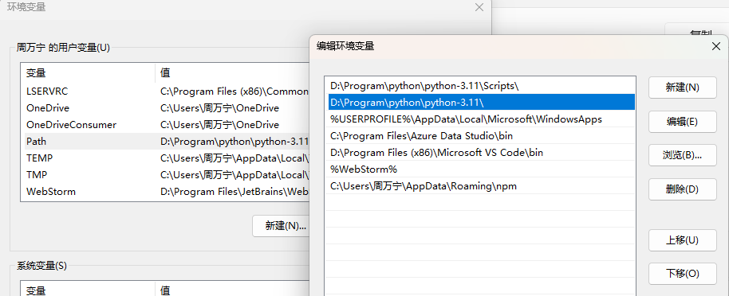
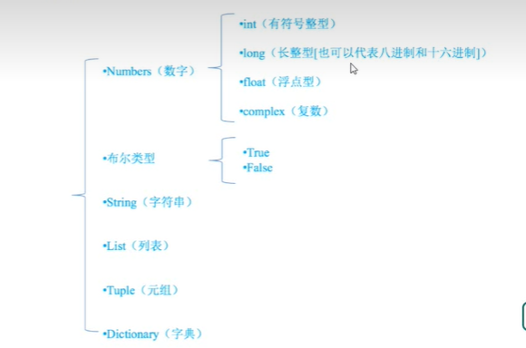
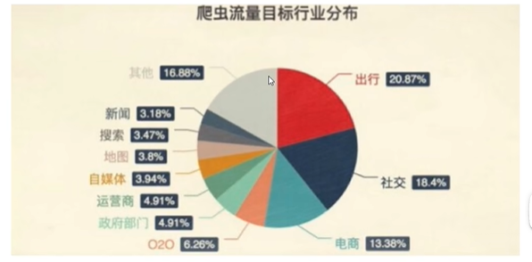
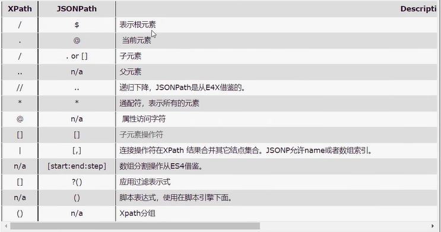

# python 学习

## 一 python基础

### 1 python 环境的安装

[python-3.11下载(华为源镜像)](https://mirrors.huaweicloud.com/python/3.11.0/python-3.11.0-amd64.exe)

如果在安装的时候没有选中添加环境变量,可以在环境变量中添加环境变量如下图所示:

要将python添加到用户变量中的python中



### 2 pip的使用

#### 2.1 pip的安装与配置

1. pip的安装: 在安装python时会自动安装pip
2. pip -V: 查看当前pip版本
3. 如果控制台输入 `pip -V` 不是内部指令, 需要将python的scripts目录添加到环境变量中的path中


#### 2.2 使用pip管理python包

- `pip install<包名>` 安装指定的包
- `pip uninstall<包名>` 卸载指定的包
- `pip list` 显示已经安装的包
- `pip freeze` 显示已经安装的包,并且以指定的格式显示

#### 2.3 修改pip下载源

运行 `pip install` 命令会从网站上下载指定的python包, 默认是从默认提供的国外网站上下载,遇到网络状况不好的时候,可能会下载失败,我们可以通过指令,修改pip下载软件时的源

`pip install 包名 -i 国内源地址`


示例:`pip install ipython -i https://pypi.mirrors.ustc.edu.cn/simple/`

就是从中国科技大学(ustc)的服务器上下载requests(基于python的第三方web框架)

国内源配置  
常用的国内镜像  
阿里云 https://mirrors.aliyun.com/pypi/simple/  
豆瓣https://pypi.douban.com/simple/  
清华大学 https://pypi.tuna.tsinghua.edu.cn/simple/  
中国科学技术大学 https://pypi.mirrors.ustc.edu.cn/simple/  
华中科技大学https://pypi.hustunique.com/  
新版ubuntu要求使用https源，要注意
 

临时使用  
 在使用pip的时候，加上参数 -i 和镜像地址

可以使用pycharm集成开发环境进行python的开发  

可以在 pycharm 的 setting 中更改 python script 模板 


### 3 python基础

#### 3.1 注释

单行注释: `# 单行注释`  
多行注释:

```python
'''多行注释
    多行注释的范围
'''

```  

#### 3.2 变量的声明

变量声明的规则: `变量名 = 变量值`

#### 3.3 变量的类型

程序里: 在Python里为了应对不同的业务需求,也把数据分为不同的类型  
如下图所示  


```python

money = 5000  # int类型
money1 = 2.33  # float类型

# boolean 布尔
# 流程控制语句

# 字符串: 使用的是单引号 或者 双引号
name = '勋悟空'
name1 = '猪八戒'

# list 列表
# tuple 元组
# dict 字典

# list 列表
# 应用场景: 当获取到了很多个数据的时候,那么我们可以将它们存储到列表中,然后直接使用列表访问
name_list = ['勋悟空', '猪八戒', '白骨精']
print('name', name_list[1])

# tuple 元组
age_tuple = (18, 20, 21)
print('age_tuple', age_tuple)

# dict 字典
# 应用场景: scrapy框架使用

# 格式: 变量的名字 = {key: value}
person = {
    'name': '勋悟空',
    'age': 20
}

print('person', person)

```

#### 3.4 查看数据类型

- 在python中,只要定义了一个变量,而且它有数据,那么它的类型就已经确定了,不需要咱们开发者主动的去说明他的类型,系统会自动识别,也就是说在使用的时候 *"变量没有类型, 数据才有类型"*
- 如果想要查看一个变量存储的数据类型,可以使用type(变量的名字),来查看变量存储的数据类型
```python
name = '勋悟空'
age = 12
salary = 1000.21
children = ['小红', '小白', '小红']
child1 = {
    'name': '小红',
    'age': 16
}

print(type(name))
```

#### 3.5 标识符和关键字

计算机编程语言中, 标识符是用户编程时使用的名字, 用于给变量,常量,函数,语句块等命名,以建立起名称与使用之间的关系

1. 标识符由字母,下划线和数字组成,且数字不能开头
2. 严格区分大小写
3. 不能使用关键字

*命名规范*  
- 标识符命名要做到见名知义
> 起一个有意义的名字,尽量做到一言就知道是什么意思(提高代码可读性=>方便维护)
- 遵守一定命名规范
  - 驼峰命名法分为 大驼峰 和 小驼峰
  - 
  
*关键字*  
- 关键字的概念
  - 一些具有特殊功能的标识符,这就是所谓的关键字
  - 关键字,已经被python使用了,所以不允许开发者自己定义和关键字相同名字的标识符

#### 3.6 类型转换  

| 函数 | 说明 |
|:--- |:---|
| int(x) | 将x转换为一个整数 |
|float(x)|将x转换为一个浮点数|
|str(x)|将对象x转换为字符串|
|bool(x)|将对象x转换成为布尔值|
```python
print('123.34转换成整型', int(123.34))  # 123
print('123.34转换成字符串', str(123.34))  # '123.34'
print('123.34转换bool值', bool(123.34))  # True
print('123转换成浮点型', float(123))  # 123.0

```
> bool 类型转换成整形, True ->1, False -> 0  


### 4 运算符

#### 4.1 算数运算符

|运算符|描述|
|:---|:---|
| + | 加|
|- | 减|
|*|乘|
|/| 除|
|//|取整除|
|%|取余|
|**|指数|
|()|小括号|

> 注意:混合运算是,优先级顺序为: `**` 高于 `* / % //`高于`+ -`,为了避免期以, 建议使用()来处理运算父优先级  
> 并且,不同的类型的数字在进行混合运算是,证数建辉转换成浮点数来进行运算

```python
a = 3
b = 2
# 加法运算
print('a+b=', a + b)  # 5
# 减法运算
print('a-b=', a - b)  # 1
# 乘法运算
print('a*b=', a * b)  # 6
# 除法运算,结果可以为浮点类型
print('a/b=', a / b)  # 1.5
# 取整除, 结果只会保留整数部分
print('a//b=', a // b)  # 1
# 指数运算
print('a**b=', a ** b)  # 9
# 括号运算: 会改变运算优先级
print('(a+b)*b=', (a + b) * b)  # 10
```

*算数运算符在字符串中使用*  
- 如果是两个字字符串做加法运算,会直接把这两个字符串拼成一个字符串

`print('Hello' + 'World')  # HelloWorld`

> 在python中,两端都是字符缓才可以进行拼串
- 错误写法  
`print('123' + 456)`

- 字符串的乘法, 是将字符串重复多少次  
`print('Hello' * 3)  # HelloHelloHello`

#### 4.2 赋值运算符

赋值运算符会将符号左边的值赋值给右边

```python
# 普通赋值
a = 10
# 连续赋值
b = c = 20
# 多个变量去赋值(使用逗号分隔)
d, e, f = 1, 2, 3
```

#### 4.3 复合赋值运算符  

| 运算符 | 描述|实例|  
|:--- |:--- |:---|
|+= |加法赋值运算符|c += a 等效于 c = c + a| 
| -= |减法赋值运算符 | c += a 等效于 c = c + a|
|*= | 乘法赋值运算符|c *= a 等效于 c = c * a |
|/= | 除法赋值运算符|c /= a 等效于 c = c / a |
|//= |取整除赋值运算符 |c //= a 等效于 c = c // a |
|%= | 取模赋值运算符|c %= a 等效于 c = c % a |
|**= |幂等赋值运算符 | c **= a 等效于 c = c ** a|


#### 4.4 比较运算符

| 符号 | 描述 | 作用 |
|:---|:---|:---|
|==|恒等|判断==两边是否相等|
|!=|不等|!=是否不相等|
|<>|不等|python2版本使用,python3遗弃|
| &gt; |大于|右是否大于左|
|<|小于|右是否小于左|
| &gt;= |大于等于|右是否大于等于左|
| <= |小于等于|右是否小于等于左|

> 返回的是一个bool值

#### 4.5 逻辑运算符

逻辑运算符返回bool类型

|符号|描述|作用|
|:---|:---|:---|
|and|与|`a and b` a和b都为true的时候为true|
| or |或| `a or b` a和b有一个为true的时候为true|
| not | 非 | `not a` 将a的真假取反,a为false的时候为true|

*性能提升*  

and 和 or 会有短路现象  (短路与,短路或)
and: `a and b=3` 当 and 前的值为 false 则 and 后的语句不会执行
or: `a or b=3` 当 and 前的值为 true 则 or 后的语句不会执行

> 利用 与 和 或 特性,对 and 和 or 做出优化,从而使性能得到优化

### 5 输入输出

#### 5.1 输入  

- 普通输出

`print('hello world')`

- 格式化输出
    - %s代表的是字符串
    - %d代表的是数值
  
```python
# %s 字符串
# %d 数字
name = '勋悟空'
age = 18
print('我是%s' % name)  # 我是勋悟空
print('我是%s,我今年%d岁了' % (name, age))  # 我是勋悟空,我今年18岁了
```

#### 5.2 输入

- input

```python
# name 赋值为输入的值
name = input('请输入你的姓名\n')
# 输出
print('我是%s' % name)   
```

### 6 流程控制语句

#### 6.1 if控制语句

- if语句是用来进行判断的,其格式如下

```
    if 要判断的条件:
        条件成立时,要执行的语句
```
> if 下面的代码 必须是一个 tab 键 或者是 四个空格
- 示例:

```python
age = input('请输入你的年龄:\n')
age = int(age)
if age >= 18:
    print('您的年龄是%d,您已经成年,可以进入网吧' % age)
```

#### 6.2 if-else语句

- if-else 的使用格式  
``` 
if 条件:
    满足条件的操作
else: 
    不满足条件的操作
```

- 示例

```python
age = input('请输入你的年龄:\n')
age = int(age)
if age >= 18:
    print('您的年龄是%d,您已经成年,可以进入网吧' % age)
else:
    print('未成年人不允许进入网吧')
```

#### 6.3 elif

- elif 的使用格式如下: 
```
if xxx1:
    事件1
elif xxx2:
    事件2
elif xxx3:
    事件3
```
说明:  
- 当xxx1满足时,执行事件1,然后整个if结束
- 当xxx1不满足, xxx2满足,执行事件2,然后整个if结束
- 当xxx1,xxx2都不满足 xxx3满足, 则执行事件3,然后整个if结束

- 示例:

```python
age = input('请输入你的年龄:\n')
age = int(age)
if age >= 18:
    print('您的年龄是%d,您已经成年,可以进入网吧' % age)
elif age >= 17:
    print('马上就快成年了,再等一等吧')
elif age >= 13:
    print('小朋友, 你的作业写完了吗')
else:
    print('未成年人不允许进入0网吧')

```

#### 6.4 for循环

**for循环格式**
```
for 临时变量 in 列表或者字符串等可迭代对象:
    循环满足条件时执行的代码
```

**for循环的使用**
- 遍历字字符串

```python
for s in 'hello':
    print('%s' % s)
    
# 输出:
# h
# e
# l
# l
# o
```

**range方法的使用**  
- range方法的结果是一个可以遍历的对象

- range(n) 0-n 左闭右开区间的可遍历对象
```python
# range(5) 0-4 左闭右开区间[0,5)
for i in range(5):
    print(i)

```

- range(a,b) a到b-1 左闭右开区间的可遍历对象
  - a 起始值
  - b 结束值

```python
# range(1, 6) 1-5 左闭右开区间[1,6)
for i in range(1, 6):
    print(i)
```

- range(a,b,c)  a到b-1左闭右开, 从a开始每次+c
  - a 起始值
  - b 结束值
  - c 步长

```python
for i in range(1, 10, 3):
    print(i)

# 结果
# 1
# 4
# 7
```

**循环一个列表**

```python
words = ['只', '因', '你', '太', '美']
for word in words:
    print(word)

# 结果
# 只
# 因
# 你
# 太
# 美
```


### 7 数据类型高级

#### 7.1 字符串高级

字符串的常见操作包括:
- 获取长度: len  len函数可以获取字符串的长度
- 查找内容: find 查找指定内容再字符串中是否存在,如果存在就返回该内容在字符串第一次出现的开始位置索引值,如果不存在,则返回-1
- 判断: startswith,endswith  判断字符串是不是以某某开头/几位
- 计算出现的次数: count 返回 某字符串 在start和end之间 在 字符串 里面出现的次数
- 替换内容: replace  替换字符串中指定的内容,如果指定次数count,则替换不会超过count次
- 切割字符串: split 同故宫参数的内容切割字符串
- 修改大小写: upper,lower 将字符串中的大小写字母转换
- 空格处理: strip 去空格
- 字符串拼接: join 字符串拼接

#### 7.2 列表高级

列表的增删改查  
**添加元素**  

添加元素右以下几个方法:  
- append 在末尾添加元素
- insert 在指定位置插入元素
- extend 合并两个列表

**append**

append 会把新元素添加到列表末尾

```python

names = ['勋悟空', '猪八戒', '沙和尚']
print("添加前的数据", names)  # 添加前的数据 ['勋悟空', '猪八戒', '沙和尚']
# 添加数据
names.append('唐僧')
print('添加后的数据', names)  # 添加后的数据 ['勋悟空', '猪八戒', '沙和尚', '唐僧']
```

##### **insert**

在指定位置添加元素

```python
names = ['勋悟空', '猪八戒', '沙和尚']
names.insert(1, 'IKun')
print('添加后的数据', names)  # 添加后的数据 ['勋悟空', 'IKun', '猪八戒', '沙和尚']
```


**extend**

合并两个列表
```python
names = ['勋悟空', '猪八戒', '沙和尚']
names1 = ['IKun', '唐僧']
names.extend(names1)
print('合并后的数据', names)  # 合并后的数据 ['勋悟空', '猪八戒', '沙和尚', 'IKun', '唐僧']
```

##### **修改元素**

我们是通过指定下标来访问列表元素,因此修改元素的时候,为指定的列表下标赋值即可
```python
names = ['勋悟空', '猪八戒', '沙和尚']
names[1] = 'KunKun'
print('修改后的数据', names)  # 修改后的数据 ['勋悟空', 'KunKun', '沙和尚']
```

##### **查找元素**

所谓的查找,就是判断指定的元素是否存在,以及查看元素的所在的位置,主要包含以下几个方法:  
- in 和 not in
- index 和 count

**in,not in**  
python中查找的查用方法为:  
- in(存在),如果存在那么结果为true,否则为false
- not in(不存在),如果不存在那么为true,否则为false

```python
names = ['勋悟空', '猪八戒', '沙和尚']
findName = input('请输入你要查找的姓名:\n')
print('查找的名字是否存在', findName in names)  # 返回值为True 或 False
```

**index**

返回指定元素的索引位置
```python
names = ['勋悟空', '猪八戒', '沙和尚']
print('勋悟空的位置', names.index('勋悟空'))  # 勋悟空的位置 0
```

**count**

指定元素在List中的个数
```python
names = ['勋悟空', '猪八戒', '沙和尚']
print('names中勋悟空有几个', names.count('勋悟空'))  # names中勋悟空有几个 1
```

##### **删除元素**

列表常用的删除方法有:  
- del: 根据下标进行删除
- pop: 删除最后一个元素
- remove: 根据元素的值进行删除

**del**  
```python
names = ['勋悟空', '猪八戒', '沙和尚']
del names[2]
print('删除后的列表', names)  # 删除后的列表 ['勋悟空', '猪八戒']
```

**pop**
```python
names = ['勋悟空', '猪八戒', '沙和尚']
names.pop()
print('删除后的列表', names)  # 删除后的列表 ['勋悟空', '猪八戒']
names.pop(1) 
print('删除后的列表', names)  # 删除后的列表 ['勋悟空']
```
> pop不接受参数默认删除最后一个元素, pop可以接受一个int类型的参数,可以删除指定索引位置的元素

**remove**  
```python
names = ['勋悟空', '猪八戒', '沙和尚']
names.remove('勋悟空')
print('删除后的列表', names)  # 删除后的列表 ['猪八戒', '沙和尚']
```

#### 7.3 **元组高级**  

python的元组与列表类似,不同之处在于**元组的元素不能修改**,元组使用小括号,列表使用方括号
`names = ('勋悟空', 77, 99.99)`
      
**访问元组**
```python
names = ('勋悟空', 77, 99.99)
print(names[0])
```

**修改元组**  
python中不允许修改元组的数据,包括不能删除其中的元素  
**定义只有一个数据的元组**  
定义一个只有一个元素的元组,需要**在唯一的元素后写一个逗号**  
`oneTuple = ('卡卡西',)
`

#### 8.4 切片

切片是指操作的对象截取其中的一部分的操作,**字符串,列表,元组**都支持切片操作  
切片的语法:`[起始:结束:步长]`, `也可以简化使用[起始:结束]`  
注意: 选育器地区间从'起始'位开始,到'结束'位的前一位结束(不包含结束位本身),步长表示选取间隔

```python
s = '01234567'
print(s[4])  # 4   字符串中的第四个元素
print(s[1:7])  # 123456 包含下标1,不包含下标7
print(s[1:])  # 1234567 从下标1开始,取出 后面所有的元素(没有结束位置)
print(s[:4])  # 0123  从开始到 下标为4的前一个元素(没有开始位置)
print(s[1:5:2])  # 13 从下标为1开始,取到下标为5的前一个元素, 步长为2 (不包含结束位置本身)
```
#### 8.5 字典高级

##### **查看元素**  

除了使用key查找数据,还可以使用get来获取数据 

```python
info = {'name': '勋悟空', 'age': 3200}
print(info['name'])  # 勋悟空
# print(info['sex'])  # 如果key不存在,就会发生异常

print(info.get('sex'))   # None # 获取不存在的key, 获取到空的内容, 不会出现异常
print(info.get('sex', '男'))   # 男 # 获取不存在的key, 可以提供一个默认值

```

##### **修改元素**  

字典的每个元素中的数据是可以修改的, 只要通过key找到, 即可修改  
  
```python
info = {'name': '勋悟空', 'age': 3200}
print('修改前的字典为 %s:' % info)
info['age'] = 2000  # 为已存在的键赋值就是修改
```

#####  **添加元素**

字典的元素是可以添加, 通过key进行添加
```python
info = {'name': '勋悟空', 'age': 3200}
print('修改前的字典为 %s:' % info)
info['id'] = 10086  # 为不存在的键赋值就是添加
print('修改后的字典为 %s:' % info)  # 修改后的字典为 {'name': '勋悟空', 'age': 2000, 'id': 10086}:
```

##### **删除元素**  
- del
1. 删除字典中指定的一个元素
```python
info = {'name': '勋悟空', 'age': 3200}
del info['age']
print('删除age后的字典为 %s:' % info)  # 删除age后的字典为 {'name': '勋悟空'}:
```
2. 删除整个字典
```python
info = {'name': '勋悟空', 'age': 3200}
del info
print('删除info字典%s' % info)  # 报错: NameError: name 'info' is not defined
```
- clear
  - 清空字典,但是保留字典对象
```python
# 删除
info = {'name': '勋悟空', 'age': 3200}
info.clear()
print('清空info字典后为%s' % info)  # 清空info字典后为{}
```

##### **字典的遍历**  

1. 遍历字典的key
- 字典`.keys()`方法可以获取字典中所有key的值, key是一个变量的名字
```python
info = {'name': '勋悟空', 'age': 3200}
for key in info.keys():
    print(key)

# 输出结果
# name
# age
```
2. 遍历字典的value
- 字典`.values()`方法可以获取字典中所有的value值
````python
info = {'name': '勋悟空', 'age': 3200}
for value in info.values():
    print(value)

# 输出结果
# 勋悟空
# 3200
````
3. 遍历字典的key和value  
```python
info = {'name': '勋悟空', 'age': 3200}
for key, value in info.items():
    print(key, value)
# 输出结果
# name 勋悟空
# age 3200
```
4. 遍历字典的项/元素  
```python
info = {'name': '勋悟空', 'age': 3200}
for item in info.items():
    print(item)
# 输出结果
# ('name', '勋悟空')
# ('age', 3200)
```

### 9 函数  

#### 9.1 定义函数  

定义函数的格式如下:  
```
def 函数名():
    代码
```
示例:  
```python
# 定义函数,能够完场打印信息功能
def fun():
    print('欢迎来到红浪漫')
```
#### 9.2 调用函数

定义了函数之后, 就相当于有了一个具有某些功能的代码,想让这些代码能够执行, 需要调用它, 通过 **函数名()** 即可完成调用
```python
# 定义函数,能够完场打印信息功能
def fun():
    print('欢迎来到红浪漫')
    
    
# 定义完函数后, 函数不是自动执行的, 需要调用它才可以
fun()  # 欢迎来到红浪漫
```

#### 9.3 函数参数
```python
# 定义一个函数,进行两个数的加法运算
def add(a, b):
    c = a + b
    print(c)


# 调用函数 
# 位置传参
add(1, 2)

# 关键字传参(不推荐使用)
add(b = 200, a = 100)
```
注意点:  
- 在定义的函数的时候, 小括号里写等待赋值的变量
- 在调用函数的时候, 小括号里写真正要进行的运算的数据  
> 定义时小括号中的实参, 用来接收参数用的称为'形参'  
> 调用时小括号中的参数, 用来传递给函数调用的,称为'实参'

#### 9.4 函数返回值  

**返回值介绍**  
- 所谓的'返回值',就是程序中完成一件事情后,最后给调用者的结果
- 使用返回值的前提需求就是函数调用者想要在函数外使用计算结果

**带有返回值的函数**  
想要在函数中把结果返回给调用者,需要在函数中使用return  
示例:
```python
# 定义一个函数计算两个数的加法
def add(a, b):
    c = a + b
    return c


print(add(1, 2))  # 3
```

#### 9.5 局部变量

**什么时局部变量**  
> 局部变量, 就是在函数内部定义的变量  
> 其作用范围时这个函数内部, 即只能在这个函数中使用, 在函数的外部时不能使用的

#### 9.6 全局变量

如果一个变量,既能在一个函数中使用, 也能在其他函数中使用,这样的变量就是全局变量


### 10 文件

### 10.1 文件的打开于关闭

**打开文件/创建文件**  
在python中, 使用open函数,可以打开一个已经存在的文件, 或者创建一个新文件  
`open(文件路径, 访问模式)`  
示例:
```python
# 打开文件
f = open('test.txt', 'w')
```
说明:  
**文件路径**  
- 绝对路径: 指的时绝对位置, 完整的描述了目标的所在地, 所有目录层级关系是一目了然的
  - 例如: `E:\python`, 从电脑的盘符开始, 表示的就是一个绝对路径
- 相对路径: 是从当前文件所在的文件夹开始的路径
  - `test.txt`, 是当前问价夹查找`test.txt`文件
  - `./test.txt`, 也是在当前文件夹里查找`test.text`文件, `./`表示的是当前文件夹
  - `../test.txt`, 从当前文件夹的上一级问价里查找`test.txt`文件, `../`表示的是上一级问价夹  
  - `demo/test.txt`, 当前文件夹里查找`demo`这个文件夹,并在这个文件夹里查找`test.txt`文件

**访问模式**  

|访问模式|说明|
|:---|:---|
|r | 以只读的方式打开文件,文件的指针将会放在文件的开头,如果文件不存在,则报错,**这是默认模式**|
|w | 打开一个文件只用于吸入, 如果该文件已经存在则将其覆盖, 如果该文件不存在, 创建新文件|
|a | 打开一个文件用于追加,如果该文件已存在, 文件指针将会放在文件的结尾; 也就是说, 新的内容将会被写入到已有内容之后, 如果该文件不存在, 创建新文件进行写入| 
| r+ |打开一个文件用于读写, 文件指针将会放在文件的开头 |
| w+  | 打开一个文件用于读写,如果该文件已存在则将其覆盖,如果该文件不存在,创建新文件 |
| a+ | 打开一个文件用于读写,如果文件已经存在,文件指针将会放在文件的结尾,文件打开时会是追加模式; 如果该文件不存在, 创建新文件用于读写 |
| rb | 以二进制的格式打开一个文件用于只读,文件指针将会放在文件的开头 |
| wb | 以二进制的格式打开一个文件只用于写入,如果该文件已经存在则将其覆盖,如果该文件不存在,创建新文件 |
| ab | 以二进制格式打开一个文件用于追加, 如果该文件已存在, 文件指针将会放在文件的结尾, 也就是说, 新的内容将会写入到已有的内容之后, 如果该文件不存在, 创建新文件进行写入 |
| rb+ | 以二进制打开一个文件用于读写,文件指针将会放在文件的开头 |
| wb+ | 以二进制格式打开一个文件用于读写,如果该文件已存在则将其覆盖,如果该文件不存在,创建新文件|
| ab+ | 以二进制格式打开一个文件用于读写, 如果该文件已存在, 文件指针将会放在文件的结尾, 如果该文件不存在, 创建新文件用于读写 |

**文件的关闭**  
可以使用close函数对文件进行关闭
```python
fp = open('test.txt', 'w')

fp.close()
```

#### 10.2 文件的读写

**写数据(write)**  
使用write()可以完成向文件写入数据
```python
# 文件的读写
# 打开一个文件
f = open('test.txt', 'w')
# 向文件中写入数据
f.write('hello world')
# 关闭文件
f.close()
```
**读数据**
- read  
使用read()可以完成对文件数据的读取
```python
fp = open('test.txt', 'r')
# 默认情况下 read是一字节一字节的读效率比较低
content = fp.read()
print(content)
```
> 默认情况下 read是一字节一字节的读效率比较低
- readline  
使用readline()可以完成对文件的整行读取
```python
fp = open('test.txt', 'a')
# readline只能读取一行
content = fp.readline()
print(content)
```
> 默认秦凯给你下,readline只能读取一行

- readlines  
读取多行数据
```python
fp = open('test.txt', 'a')
content = fp.readlines()
print(content)
```
> `readlines`可以按照行来读取, 会将所有的数据都读取到, 并且以一个列表的形式返回  
> 列表的元素, 是一行一行的数据


#### 10.3 序列化和反序列化

通过文件操作, 我们可以将字符串写入到一个本地文件, 但是, 如果一个对象(例如列表, 字典, 元组等), 就无法直接写入到
一个文件里,需要对这歌对象进行序列化, 然后才能写入到文件里

设计一套协议, 按照某周规则, 将内存中的数据转换为字节序列保存到文, 这就是序列化, 反之, 从文件的字节序列恢复到内存中, 就是反序列化

> 对象 => 字节序列  === 序列化  
> 字节序列 => 对象 === 反序列化  

python提供了JSON这个模块用来实现数据的序列化和反序列化

**JSON模块**

JSON(JavaScriptObjectNotation, JS对象简谱)是一种轻量级的数据交互标准, JSON的本质是字符串  

**使用JSON实现序列化**  
JSON提供了dump和dumps方法,将一个对象进行序列化  
dumps方法的作用是把对象转换为字符串,它本身不具备将数据写入到文件的功能

```python
import json
file = open('names.txt', 'w')
names = ['勋悟空', '猪八戒', '沙和尚', '唐僧']

# file.write(names)  # 出错,不能直接将列表写入到文件里

# 可以调用 json 的 dupms 方法, 传入一个对象参数
result = json.dumps(names)

# dumps 方法得到的结果是一个字符串
print(type(result))  # <class 'str'>

# 可以将字符出啊写入到文件里
file.write(result)
```

- dump
在对象转换为字符串的同时,指定一个文件对象,然后把转换后的对象字符串写入到这文件中
```python
import json

file = open('names.txt', 'w')
names = ['勋悟空', '猪八戒', '沙和尚', '唐僧']
json.dump(names, file)

file.close()
```

**反序列化**  
JSON提供了load和loads方法,将一个对象进行序列化  
loads方法的作用是把字符串转换对象,它本身不具备将读取文件的功能
```python
import json
fp = open('names.txt', 'r')

content = fp.read()
print(content)
print(type(content))  # <class 'str'>
result = json.loads(content)
print(result)
print(type(result))  # <class 'list'>

```

- load
load 方法的作用是将文件对象的数据反序列化,返回一个反序列出来的对象
```python
import json
fp = open('names.txt', 'r')
result = json.load(fp)
print(result)
print(type(result))
fp.close()
```

### 11 异常

程序在运行过程中, 由于我们的编码不规范, 或者其他原因一些客观原因, 导致我们的程序无法继续运行, 此时, 程序就会出现异常, 如果我们不对异常进行处理, 程序可能会由于异常直接中断掉;
为了保证程序的健壮性,我们在程序设计里提出了异常处理这个概念

#### 11.1 读取异常异常

在读取一个文件是,如果这个文件不存在,则会爆出`FileNotFoundError`  


#### 11.2 异常的捕获

- 格式  
```
try:
    可能出现异常的代码
except 异常的类型: 
    友好的提示 
```
- 示例
```python
try:
    f = open('卡卡西.txt', 'r')
    print(f.read())
except FileNotFoundError:
    print('文件不存在')
```

## 二 Urllib

### 1 什么是互联网爬虫


如果我们把互联网比作一张大的蜘蛛网, 那一台计算机上的数据就是蜘蛛网上的猎物, 而爬虫程序就是一只小蜘蛛,
沿着蜘蛛网抓取自己想要的数据

> 解释1: 通过一个程序,根据 url 进行爬取网页, 获取有用的信息  
> 解释2: 是程序模拟浏览器, 取向服务器发送请求, 获取响应信息

### 2 爬虫核心?

> 1.爬取网页: 爬取整个网页, 包含了网页中所有的内容  
> 2.解析数据: 将网页中你得到的数据, 进行解析  
> 3.难点: 爬虫和反爬虫之间的博弈

### 3 爬虫的用途

- 数据分析/人工数据集
- 社交软件冷启动
- 舆情监控
- 竞争对手监控



### 4 爬虫分类

通用爬虫:  
> 实例:  
> > 百度,360,google,sougou等搜索引擎 --- 伯乐在线  
>
> 功能  
> > 访问网页->抓取数据->数据存储->数据处理->提供检索服务 
> 
> robots协议  
> > 一个约定俗成的协议, 添加robots.txt文件,来说明网站哪些内容不可以被抓取, 起不到限制作用, 自己写的爬虫无需遵守
> 
> 网站排名  
> > 1 根据PageRank算法值进行排名(参考网站流量,点击率等指标)  
> > 2 百度竞价排名
> 
> 缺点  
> > 1 抓取的数据大多是无用的  
> > 2 不能根据用户的需求来精确获取数据

聚焦爬虫
> 功能  
> > 根据需求, 实现爬虫程序, 抓取需要的数据  
> 
> 设计思路
> > 1 确定爬取的url  如何获取url  
> > 2 默契浏览器通过http协议访问url, 获取服务器返回的html代码   如何访问  
> > 3 解决html字符串(根据一定规则提取需要的数据)  如何解析

### 5 反爬手段?  

1. User-Agent:  
  User Agent中文名为用户代理, 简称UA, 它是一个特殊字符串头, 使得服务器嫩巩固识别客户使用的操作系统及版本, CPU类型,浏览器版本,浏览器渲染引擎,浏览器语言,浏览器插件等
2. 代理IP  
   1. 西次代理
   2. 快代理
   3. 什么是高匿名, 匿名和透明代理? 他们有什么区别?
      1. 使用透明代理,对方服务器可以知道你使用了代理,并且也知道你的真实IP
      2. 使用匿名大力,对方服务器可以知道你使用了代理,但不知道你的真实IP
      3. 使用高匿名代理, 对方服务器不知道你使用了代理, 更不知道你的真实IP
3. 验证码访问
   1. 打码平台
      1. 云打码平台
      2. 超级🦅
4. 动态加载网页,网站返回的是js数据,并不是网页的真实数据  
  selenium驱动真实的浏览器发送请求
5. 数据加密  
   分析js代码

### 6. urllib 库使用

- urllib-request.urlopen() 模拟浏览器向服务器发送请求
- response 服务器返回的数据
  - response的数据类型是HttpResponse
  - 字节-->字符串
    - 节码decode
  - 字符串-->字节
    - 编码encode
  - read() 字节形式读取二进制 扩展read(5) 返回前几个字节
  - readlines() 一行一行获取 直至结束
  - getcode() 获取状态码
  - geturl() 获取url
  - getheaders() 获取headers
- urllib.request.urlretrieve()
  - 请求网页
  - 请求图片
  - 请求视频

### 7 请求对象的定制

UA介绍: User Agent 中文名为用户代理, 简称UA, 它是一个特殊字符串头, 使得服务器能都识别客户使用的操作系统,CPU类型,浏览器及版本,浏览器内核,浏览器渲染引擎,浏览器语言,浏览器插件等

语法: request = urllib.request.Request()


### 8 解编码

**1. get请求方式: urllib.parse.quote()**

eg:  
```python
# 需求: 获取 https://www.baidu.com/s?wd=周杰伦 的网页源码

url = 'https://www.baidu.com/s?wd='

# 请求对象的定制为了解决反爬的第一种手段
headers = {
    'User-Agent': 'Mozilla/5.0 (Windows NT 10.0; Win64; x64) AppleWebKit/537.36 (KHTML, like Gecko) Chrome/110.0.0.0 Safari/537.36 Edg/110.0.1587.56}'
}

# 将周杰伦三个字编程unicode编码的格式
# 我们需要依赖于urllib.parse
name = urllib.parse.quote('周杰伦')
print('name', name)

url = url + name

# 请求对象的定制
request = urllib.request.Request(url=url, headers=headers)

# 模拟浏览器向服务器发送请求
response = urllib.request.urlopen(request)

content = response.read().decode('utf-8')

# 打印数据
print(content)
```
**2. get亲求方法: urllib.parse.urlencode()**  
eg:  
```python
import urllib.request
import urllib.parse

# urlencode应用场景: 多个参数的时候
# url = 'https://www.baidu.com/s?wd=周杰伦&sex=男'
base_url = 'https://www.baidu.com/s?'
# 定义一个字典
data = {
    'wd': '周杰伦',
    'sex': '男',
    'location': '中国台湾省'
}
# 将字典中的数据转成请求参数并且进行编码
new_data = urllib.parse.urlencode(data)

print(new_data)
# 将url 进行拼接
url = base_url + new_data
# 请求头信息
headers = {
    # 用户代理 浏览器等用户信息
    'User-Agent': 'Mozilla/5.0 (Windows NT 10.0; Win64; x64) AppleWebKit/537.36 (KHTML, like Gecko) Chrome/110.0.0.0 Safari/537.36 Edg/110.0.1587.56}'
}

# 请求对象的定制
request = urllib.request.Request(url=url, headers=headers)

# 模拟浏览器发送请求
response = urllib.request.urlopen(request)

# 获取网页的数据
content = response.read().decode('utf-8')

print(content)
```

**3. post请求方法**  

```python
import urllib.request
import urllib.parse
import json

# post 请求
url = 'https://fanyi.baidu.com/sug'

headers = {
    # 用户代理 浏览器等用户信息
    'User-Agent': 'Mozilla/5.0 (Windows NT 10.0; Win64; x64) AppleWebKit/537.36 (KHTML, like Gecko) Chrome/110.0.0.0 Safari/537.36 Edg/110.0.1587.56}'
}

data = {
    'kw': 'spider'
}
# post请求的参数 必须要进行编码
data = urllib.parse.urlencode(data).encode('utf-8')

# post的请求的参数,是不会拼接在url的后面的,而是需要放在请求对象定制的参数中
# post亲求的参数 必须要进行编码
request = urllib.request.Request(url=url, data=data, headers=headers)

# print(request)

# 模拟六零奶骑向服务器发送请求
response = urllib.request.urlopen(request)

# 获取响应的数据
content = response.read().decode('utf-8')

print('content')
print(content)
# 字符串->json对象
obj = json.loads(content)
print(obj)

# post请求方式的参数 必须编码
# 编码之后
# 请求参数放在请求对象定制的方法中
```

> post请求的注意事项:  
> 
> post请求方式的参数 必须编码  
> 编码之后  
> 请求参数放在请求对象定制的方法中

### 9 ajax的get请求

案例:豆瓣电影

```python
#!/usr/bin/env python
# -*- coding:utf-8 -*-
# @FileName  :010_ajax的get请求豆瓣电影前十页.py
# @Time      :2023/2/27 16:23
# @Author    :周万宁

import json
import urllib.parse
import urllib.request


def create_request(page):
    base_url = 'https://movie.douban.com/j/chart/top_list?type=5&interval_id=100%3A90&action=&'

    data = {
        'start': 20 * (page - 1),
        'limit': 20
    }

    data = urllib.parse.urlencode(data)

    url = base_url + data

    headers = {
        # 用户代理 浏览器等用户信息
        'User-Agent': 'Mozilla/5.0 (Windows NT 10.0; Win64; x64) AppleWebKit/537.36 (KHTML, like Gecko) Chrome/110.0.0.0 Safari/537.36 Edg/110.0.1587.56}'
    }

    request = urllib.request.Request(url=url, headers=headers)
    return request


# 获取响应的数据
def get_content(request):
    response = urllib.request.urlopen(request)
    content = response.read().decode('utf-8')
    return content


def down_load(content, page):
    page = str(page)
    with open('doubanPages/douban' + page + '.json', 'w', encoding='utf-8') as fp:
        fp.write(content)


# 程序的入口
if __name__ == "__main__":
    start_page = int(input('请数据起始的页码'))
    end_page = int(input('请输入结束的页码'))

    for page in range(start_page, end_page + 1):
        # 每一页都有自己的请求对象的定制
        request = create_request(page)
        # 获取响应的数据
        content = get_content(request)
        # content = json.loads(content)
        # 下载
        down_load(content, page)

# 下载豆瓣电影前10页的数据
# 1. 请求对象的定制
# 2. 获取响应的数据
# 3. 下载数据
```

# ajax的post请求  

案例: 肯德基  
```python
# http://www.kfc.com.cn/kfccda/ashx/GetStoreList.ashx?op=cname
# cname: 北京
# pid:
# pageIndex: 1
# pageSize: 10

import urllib.request
import urllib.parse
import json


def create_request(page):
    base_url = 'http://www.kfc.com.cn/kfccda/ashx/GetStoreList.ashx?op=cname'

    data = {
        'cname': '北京',
        'pid': '',
        'pageIndex': page,
        'pageSize': 10
    }

    data = urllib.parse.urlencode(data).encode('utf-8')

    headers = {
        # 用户代理 浏览器等用户信息
        'User-Agent': 'Mozilla/5.0 (Windows NT 10.0; Win64; x64) AppleWebKit/537.36 (KHTML, like Gecko) Chrome/110.0.0.0 Safari/537.36 Edg/110.0.1587.56}'
    }

    request = urllib.request.Request(url=base_url, data=data, headers=headers)
    return request


# 获取响应的数据
def get_content(request):
    response = urllib.request.urlopen(request)
    content = response.read().decode('utf-8')
    return content


def down_load(content, page):
    page = str(page)
    with open('kfcPages/kfcPage' + page + '.json', 'w', encoding='utf-8') as fp:
        fp.write(content)


if __name__ == "__main__":
    start_page = int(input('清输入起始页码'))
    end_page = int(input('清输入结束页码'))
    for page in range(start_page, end_page + 1):
        request = create_request(page)
        content = get_content(request)
        down_load(content, page)

```

### 11 URLError\HTTPError

简介:  
1. HTTPError异常类是URLError的字类
2. 导入的包urllib.error.HTTPError  urllib.error.URLError
3. http错误: http错误是针对浏览器无法连接到服务器而增加出来的错误提示,引导并告诉浏览器该页是哪里出了问题
4. 通过urllib发送请求的时候, 有可能会发送失败, 这个时候如果想然你的代码更加健壮, 可以通过try-except进行捕获异常,异常又两类,URLError\HTTPError


### 13 Handler处理器

为什么要学习handler?  
urllib.request.urlopen(url)  
    不能定制请求头  
urllib.request.Request(url,headers,data)  
    可以定制请求头  

Handler  
定制更高级的请求头,(随着业务逻辑的复杂,请求对象的定制已经满足不了我们的需求,同台cookie和代理不能使用请求对象的定制)

**基本使用**  
eg:
```python
import urllib.request

url = 'http://www.baidu.com'

headers = {
    # 用户代理 浏览器等用户信息
    'User-Agent': 'Mozilla/5.0 (Windows NT 10.0; Win64; x64) AppleWebKit/537.36 (KHTML, like Gecko) Chrome/110.0.0.0 Safari/537.36 Edg/110.0.1587.56}'
}
# 请求对象的定制
request = urllib.request.Request(url=url, headers=headers)

# handler build_opener open

# 1) 获取handler对象
handler = urllib.request.HTTPHandler()

# 2) 获取opener对象
opener = urllib.request.build_opener(handler)

# 3) 调用open方法

response = opener.open(request)
content = response.read().decode('utf-8')

print(content)

```


### 14 代理服务器  

1. 代理的常用功能?
   1. 突破自身IP访问限制,访问国外站点
      1. 访问一些单位或团体的内部资源
         1. 扩展: 某大学FTP(前提是该代理地址在资源允许的访问范围之内), 使用教育网内地址免费代理服务器,就可以用于对于教育网海航的各类FTP下载上传,以及各类资料查询共享等服务
      2. 提高访问速度
         1. 通常代理服务器都设置一个较大的硬盘缓冲区,当有外界的信息通过时,同时也将其保存到缓冲区中,当其他用户访问相同的信息时,则直接由缓冲去中取出信息,传给用户,以提高访问速度
      3. 隐藏真实ip
         1. 扩展: 上网者页可以通过这种方法隐藏自己的IP,免受攻击
2. 代理配置代理
   1. 创建Request对象
   2. 创建ProxyHandler对象
   3. 使用handler对象创建opener对象
   4. 使用opener,open函数发送请求

eg:  

```python
import urllib.request

url = 'http://www.baidu.com/s?wd=ip'

headers = {
    # 用户代理 浏览器等用户信息
    'User-Agent': 'Mozilla/5.0 (Windows NT 10.0; Win64; x64) AppleWebKit/537.36 (KHTML, like Gecko) Chrome/110.0.0.0 Safari/537.36 Edg/110.0.1587.56}'
}
# 请求对象的定制
request = urllib.request.Request(url=url, headers=headers)

proxies = {'http': '117.94.113.72:9000'}

# 模拟浏览器访问服务器
# response = urllib.request.urlopen(request)

# handler build_opener open
handler = urllib.request.ProxyHandler(proxies=proxies)

opener = urllib.request.build_opener(handler)

response = opener.open(request)

# 获取响应信息
content = response.read().decode('utf-8')

# 保存
with open('daili.html', 'w', encoding='utf-8') as fp:
    fp.write(content)

```


### 15 代理池

```python

proxies_pool = [
    {
        'http': '118.24.219.151:16817'
    },
    {
        'http': '118.24.219.151:11648'
    },
]

proxies = random.choice(proxies_pool)
print(proxies)
```

### 16. xpath  

xpath使用:  
注意: 提前安装xpath插件
1. 安装lxml库  
   `pip install lxml -i https:pypi.douban.com/simple`
2. 导入 `lxml.etree`  
    `from lxml import etree`
3. etree.parse() 解析本地文件
4. entree.HTML() 服务器响应文件  
   `html_tree = etree.HTML(response.read().decode('utf-8'))`
5. `html_tree.xpath(xpath路径)`

``` 
xpath基本语法:
    1. 路径查询
        //: 查找所有子孙节点,不考虑层级关系
        /: 找直接子节点
    2. 谓词查询
    // div[@id]
    // div[@id="maincontent"]
    3. 属性查询
    // @class
    4. 模糊查询
    // div[contains(@8id,"he")]
    // div[starts-with(@id,"he")]
    
    5. 内容查询
        //div/h1/text()
    6.逻辑运算
        //div[@id="head" and @class="s_down"]
        //title | //price
```

### 17 站长素材爬取
```python

#!/usr/bin/env python
# -*- coding:utf-8 -*-
# @FileName  :019_站长素材.py
# @Time      :2023/2/28 14:33
# @Author    :周万宁


# https://sc.chinaz.com/tupian/fengjingtupian.html

# (1) 请求对象的定制
# (2) 获取玩也的源码
# 需求 下载的前十页的图片

import urllib.request
from lxml import etree

def create_request(page):
    if (page == 1):
        url = 'https://sc.chinaz.com/tupian/fengjingtupian.html'
    else:
        url = 'https://sc.chinaz.com/tupian/fengjingtupian'+str(page)+'.html'

    headers = {
        # 用户代理 浏览器等用户信息
        'User-Agent': 'Mozilla/5.0 (Windows NT 10.0; Win64; x64) AppleWebKit/537.36 (KHTML, like Gecko) Chrome/110.0.0.0 Safari/537.36 Edg/110.0.1587.56}'
    }

    request = urllib.request.Request(url=url, headers=headers)
    return request


def get_content(request):
    response = urllib.request.urlopen(request)
    content = response.read().decode('utf-8')
    return content


def down_load(content):
    tree = etree.HTML(content)
    name_list = tree.xpath('//div[@class="container"]//img/@alt')

    # 一般涉及图片的网站都会进行懒加载(使用变之前的进行爬取)
    src_list = tree.xpath('//div[@class="container"]//img/@data-original')

    print(len(name_list))
    print(len(src_list))

    for i in range(len(name_list)):
        name = name_list[i]
        url = 'https:'+src_list[i]
        print(name, url)

        urllib.request.urlretrieve(url=url, filename='zzImgs/'+name+'.jpg')


    # 下载图片
    # urllib.request.urlretrieve('图片地址', '文件的名字')


if __name__ == "__main__":
    start_page = int(input('请输入起始页码'))
    end_page = int(input('请输入结束页码'))

    for page in range(start_page, end_page + 1):
        # 请求对象的定制
        request = create_request(page)
        # 获取网页的源码
        content = get_content(request)
        # 下载
        down_load(content)

```
### 18 JsonPath

``` 
jsonpath的安装及使用方式:
    pip安装:
        pip install jsonpath
    jsonpath的使用:
        obj = json.load(open('json文件', 'r', encoding='utf-8'))
        ret = jsonpath.jsonpath(obj, 'jsonpath语法')
```

JSONPath语法元素和对应的XPath元素的对比  
  


案例练习: 淘票票  
```python
#!/usr/bin/env python
# -*- coding:utf-8 -*-
# @FileName  :jsonpath解析淘票票.py
# @Time      :2023/2/28 20:06
# @Author    :周万宁

import urllib.request
import json
import jsonpath

url = 'https://dianying.taobao.com/cityAction.json?activityId&_ksTS=1677586044886_108&jsoncallback=jsonp109&action=cityAction&n_s=new&event_submit_doGetAllRegion=true'

headers = {
    # ':authority': 'dianying.taobao.com',
    # ':method': 'GET',
    # ':path': '/cityAction.json?activityId&_ksTS=1677586044886_108&jsoncallback=jsonp109&action=cityAction&n_s=new&event_submit_doGetAllRegion=true',
    # ':scheme': 'https',
    'accept': 'text/javascript, application/javascript, application/ecmascript, application/x-ecmascript, */*; q=0.01',
    # 'accept-encoding': 'gzip, deflate, br',
    'accept-language': 'zh-CN,zh;q=0.9,en;q=0.8,en-GB;q=0.7,en-US;q=0.6',
    'bx-v': '2.2.3',
    'cookie': 'miid=6182500421269191764; thw=hk; cna=81nFGkvnLWoCAW8oEclwiD0t; t=81dbd5eb5f580d63a5eac8b5bbddf48a; sgcookie=E100lmNrzZoO5eIFe6cQSo4gcVRHVCsHSsNTIlaX10i3QoieL9dJ4QO8FoMxzeP2wzxV2nZ2G0zHVHlDsUbznV1kxKJp7WBe3UxhCATO4igsGgY%3D; tracknick=tb091921008; _cc_=U%2BGCWk%2F7og%3D%3D; enc=OFfIlE7iWuNygoFTVUtMiRolWiFn60n1jJW%2BaCSFJbPRSZlv%2BFEmXak8B%2BgauDYTNFM6kQGQ5eTyp5Vms1%2F9mS4HpeGhvYJ9hj9SDV9JX98%3D; _m_h5_tk=22cfc9b380a33d04c2315a1d6a4a6fd9_1677002622642; _m_h5_tk_enc=e5e74e351dc6743d58422c7c483a6fe2; cookie2=1851cb06f19e31f021938d18fc0018b5; v=0; _tb_token_=5b878e3e36175; xlly_s=1; l=fBIqNfamLk0eyBdNBO5aourza77tnCOb81PzaNbMiIEGa6QP9Er02NCeRxYXWdtjgTfYDeKPDzebMdneJZzK0giMW_N-1NKcfD96-bpU-L5..; tfstk=cQylBSb627lWTJWLlzM5I1MvAe5AZ1drWJPa3i6vh2h3RbyViZA2_4tlmDQ1zB1..; isg=BBwcqY5ek9IcVWZcdHQLrIWh7TrOlcC_n-3qrPYYLof3Qb3LH6VBT8Y3oam5TvgX',
    'referer': 'https://dianying.taobao.com/',
    'sec-ch-ua': '"Chromium";v="110", "Not A(Brand";v="24", "Microsoft Edge";v="110"',
    'sec-ch-ua-mobile': '?0',
    'sec-ch-ua-platform': '"Windows"',
    'sec-fetch-dest': 'empty',
    'sec-fetch-mode': 'cors',
    'sec-fetch-site': 'same-origin',
    'user-agent': 'Mozilla/5.0 (Windows NT 10.0; Win64; x64) AppleWebKit/537.36 (KHTML, like Gecko) Chrome/110.0.0.0 Safari/537.36 Edg/110.0.1587.57',
    'x-requested-with': 'XMLHttpRequest',
}

request = urllib.request.Request(url=url, headers=headers)

resource = urllib.request.urlopen(request)

content = resource.read().decode('utf-8')

content = content.split('(')[1].split(')')[0]

# print(content)

with open('021_jsonpath解析淘票票.json', 'w', encoding='utf-8') as fp:
    fp.write(content)

obj = json.load(open('021_jsonpath解析淘票票.json', 'r', encoding='utf-8'))

city_list = jsonpath.jsonpath(obj, '$..regionName')

print(city_list)
```

### 19 BeautifulSoup  

1. 基本简介  
```
1. BeautifulSoup简称:
    bs423
2. 什么是BeautifulSoup?
    BeautifulSoup, 和lxml一样, 是一个html的解析器,主要功能也是解析和提取数据
3. 优缺点?
    缺点: 效率没有lxml的效率高
    优点: 接口设计人性化,使用方便
```

2. 安装以及创建
``` 
1. 安装 
    pip install bs4
2. 导入
    from bs4 import BeautifulSoup
3. 创建对象
    服务器响应的文件生成对象
        soup = BeautifulSoup(response.read().decode(),'lxml')
    本地文件生成对象
        soup = BeautifulSoup(open('1.html'),'lxml')
        注意:默认打开文件的编码格式位gbk所以需要指定编码格式

```

3. 节点定位  
``` 
1.根据标签名查找节点
    soup.a [注] 只能找到第一个a
        soup.a.name
        soup.a.attrs
2. 函数
    1) .find(返回一个对象)
        find('a'):只找第一个a标签
        find('a',title='名字')
        find('a',class='名字')    
        
    2) fin_all(返回一个列表)
        find_all('a') 查找到所有的a
        find_all(['a','span'])返回所有的a和span
        find_all('a', limit=2) 只找前两个a
    
    3) select(根据选择器得到节点对象)[推荐]
        1. element
            eg:p
        2. class
            eg: .firstname
        3. #id
            eg: #firstname   
        4. 属性选择器
            [attribute]
                eg: li = soup.select('li[class]')
            [attribute=value]
                eg: li = soup.select('li[class="l1"]')
        5. 层级选择器
            element element
                eg: div p
            element>element
                eg: div>p
            element,elemnt
                div,p
                    eg:soup=soup.select('a,span')
        
            
```

4. 节点信息
```
1) 获取节点内容: 适用于标签中嵌套标签的结构
    obj.string
    obj.get_text()[推荐]
2) 节点的属性
    tag.name 获取标签名
        eg: tag = find('li')
            pring(tag.name)
        tag.attrs将属性值作为一个字典返回
3) 获取节点属性
    obj.arrts.get('title') [常用]
    obj.get('title')
```

示例  
```python
#!/usr/bin/env python
# -*- coding:utf-8 -*-
# @FileName  :022_bs4的使用.py
# @Time      :2023/3/1 7:49
# @Author    :周万宁

from bs4 import BeautifulSoup

# 通过解析本地文件,来讲bs4的基础语法进行讲解
# 默认打开的文件的编码是gbk 所以在打开文件的时候需要指定编码
soup = BeautifulSoup(open('022_bs4的使用.html', 'r', encoding='utf-8'), 'lxml')

# 根据标签名查找节点
# 找到的是第一个符合条件的语句
# print(soup.a)

# 获取biao'qian
# print(soup.a.attrs)

# bs4的一些函数
# 1) find
# 返回的是第一个符合条件的数据
# print(soup.find('a'))  # 返回的第一个a标签
# 根据title的值来找到对应的标签对象
# print(soup.find('a', title='a2'))
# 根据class的值找到对应的标签对象, 需要注意的是class需要添加下滑线
# print(soup.find('a', class_='a1'))
# 2) find_all
# 返回的是一个列表, 会返回所有符合条件的结果
# print(soup.find_all('a'))
# 如果想获取多个标签的书,那么在find_all的参数中添加的是列表的数据
# print(soup.find_all(['a', 'span']))

# limit的作用是查找前几个书
# print(soup.find_all('li', limit=2))

# 3) select(推荐)
# select方法返回的是一个列表,并且会返回多个数据
# print(soup.select('a'))

# 可以通过. 代表class 我们把这种操作叫做类选择器
# print(soup.select('.a2'))
# 可以通过 "井号" 代表id
# print(soup.select('#l1'))

# 属性选择器 --- 通过属性来寻找对应的标签
# 查找到li标签中有id的标签
# print(soup.select('li[id]'))

# 查找到li标签
# print(soup.select('li[id="l2"]'))


# 层级选择器

# 后代选择器
# 找到的div下面的li
# print(soup.select('div li'))

# 子代选择器
# 某标签的第一级子标签
# 注意很多的计算机编程语言中, 如果不加空格不会输出内容, 但是在bs4中 不会报错,也会显示内容
# print(soup.select('ul > li'))

# 找到a标签和li标签所有的对象
# print(soup.select('a,li'))

# 节点信息
# 获取节点内容
# obj = soup.select('#l1')[0]
# 如果标签对象中 只有内容, 那么string和get_text()都可以使用
# 如果标签中 除了内容还有标签, 那么string就获取不到数据,二get_text()是可以获取数据的
# 一般情况下推荐使用get_text()
# print(obj.string)
# print(obj.get_text())

# 节点的属性
# obj = soup.select('#l1')[0]
# name是标签的名字
# print(obj.name)
# 将属性值作为一个字典返回
# print(obj.attrs)


# 获取节点的属性
obj = soup.select('#l1')[0]
# print(obj.attrs.get('id'))
print(obj.get('id'))
print(obj.attrs['id'])
```

## 三 Selenium

### 1. Selenium

1. 什么是selenium? 
``` 
    1) Selenium 是一个用于Web应用程序测试的工具
    2) Selenium 测试直接运行在浏览器中,就像真正的用户在操作营养
    3) 支持通过各种driver(FirefoxDriver,IternetExplorerDriver,OperaDriver,ChormDriver)驱动真实浏览器完成测试
    4) Selenium也是支持无界面浏览器操作的
```

2. 为什么使用Selenium?
``` 
    模拟浏览器功能,自动执行网页中的js代码,实现动态加载
```

3. 如何安装Selenium
``` 
    1) 操作谷歌浏览器驱动下载地址
    2) 谷歌驱动和谷歌浏览器版本之间的映射表
    3) 查看谷歌浏览器版本
        谷歌浏览器右上角-->帮助--->关于
    4) pip install selenium
```

4. selenium的使用步骤?

``` 
    1) 导入: from selenium import webdriver
    2) 创建谷歌浏览器操作对象
        path = 谷歌浏览器驱动文件路径
        browser = webdriver.Chorme(path)
    3)  访问网站
        url = 要访问的网址
        browser.get(url)
```
示例:

```python
from selenium import webdriver
from selenium.webdriver.chrome.service import Service

# 尝试传参
s = Service("../chromeDriver/chromedriver.exe")
driver = webdriver.Chrome(service=s)

# driver.get('https://www.baidu.com/')
# 使用浏览器驱动可以获取京东的秒杀页面
driver.get('https://www.jd.com/')
# driver.quit()
# 获取网站源码
content = driver.page_source

print(content)

```
4-1. selenium元素定位?
``` 
    元素定位: 自动化要做的就是模拟鼠标和键盘来操作这些元素, 点击,输入等等. 操作这些元素前首先要找到他们, WebDriver提供了以下的一些方法
    方法: 
        1. find_element_by_id
            eg: button = browser.find_element_by_id('su')
        2. find_element_by_name
            eg: name = brower.find_element_by_name('wd')
        3. finde_elements_by_xpath
            eg:names = browser.fin_elements_by_xpath('//input[@id="su"]')
        4. find_element_by_tag_name
            eg:names = brower.find_elements_by_tag_name('input')
        5. find_elements_by_css_selector
            eg:my_input = browser.find_elements_by_css_selector('#kw')[0]
        6.find_elements_by_link_text
            eg:browser.find_element_by_link_text('新闻')       
        
        4.1.1版本中selenium已经get_element_***中的一些方法已经被淘汰,可以使用get_element方法来取代
        get_element的使用
            通过webdriver对象的find_element("属性名","属性值")方式来定位元素
                eg:
                    button  = browser.find_element('id','su')
                    element = browser.find_element('class name','plant')
        
        通过webdriver模块中的By，以指定方式定位元素            
             导入模块：from selenium.webdriver.common.by import By
             如：定位id为username，class_name为password，tag_name为input的元素    
             from selenium.webdriver.common.by import By
             webdriver.find_element(By.ID,'username')
             webdriver.find_element(BY.CLASS_NAME,'password')
             webdriver.find_element(BY.TAG_NAME, 'input')
             
        find_element()和find_elements()的区别     
            (1) find_element()返回的结果使一个WebElement对象,如果符合条件的有多个,默认返回找到的第一个,如果没有找到则抛出NoSuchElementException异常
            (2) find_elements()返回的结果是一个包含所有符合条件的WebElement对象的列表,如果未知找到,则返回一个空列表
```
4-2: 访问元素信息
```
    获取元素属性
        .get_attribute('class')
    获取元素文本
        .text
    获取id
        .id
    获取标签名
        .tag_name            
```

4-3 交互
```
    点击: click()
    输入: send_keys()
    后退操作: brower.back()
    前进操作: brower.forword()
    模拟js滚动: 
        js = 'document.body.scrollTop=100000'
        js = 'document.documentElement.scrollTop=10000'
    获取网页代码: page_source
    退出: browser.quit()
```

示例:

```python
from selenium import webdriver
from selenium.webdriver.chrome.service import Service
from selenium.webdriver.common.by import By
# 可以使程序休眠
import time

# 创建浏览器服务对象
s = Service(r'../chromeDriver/chromedriver.exe')
driver = webdriver.Chrome(service=s)

# url
url = 'https://www.baidu.com'
driver.get(url)  # 打开网页

time.sleep(2)

# 获取文本框的对象
input = driver.find_element(By.ID, 'kw')

# 在文本框中输入周杰伦
input.send_keys('周杰伦')

time.sleep(2)

# 获取百度一下的按钮
button = driver.find_element(By.ID, 'su')

# 点击按钮
button.click()
time.sleep(2)

# 滑倒底部
js_bottom = 'document.documentElement.scrollTop=100000'
driver.execute_script(js_bottom)  # 执行js代码

time.sleep(2)

# 获取下一页的按钮
next = driver.find_element(By.XPATH, '//a[@class="n"]')
# 点击下一页
next.click()

time.sleep(2)

# 回到上一页
driver.back()

time.sleep(2)

# 回去
driver.forward()

time.sleep(3)

# 退出
driver.quit()


```

#### 2 Phantomjs

1. 什么是Phantomjs?
```
    1) 是一个无界面的浏览器
    2) 页面元素查找,js的执行等
    3) 由于不进行css和gui渲染,运行效率要比真实浏览器快很多
```
2. 如何使用Phantomjs?
```
    1) 获取PhantomJS.exe文件路径path
    2) browser = webdriver.PathtomJS(path)
    3) browser.get(url)
    扩展: 保存屏幕快照:browser.save.screenshot('baidu.png')
```
#### 3 Chrome headless 

Chrome-headless模式,Google针对Chrome浏览器59版 新增加的一种模式, 可以让你不打开ui界面的情况下使用Chrome浏览器,所以运行效果与Chrom保持完美一致


1. 系统要求:
``` 
    Chorme:
        Unix\Linux 系统需要 chrome >= 59
        Windows 系统需要 chrome >= 60
    Python3.6
    Selenium == 3.4.*
    ChromeDriver ==2.32
```
2 .使用:  
```python

from selenium import webdriver
from selenium.webdriver.chrome.options import Options

chrome_options = Options()
chrome_options.add_argument('--headless')
base_url = "http://www.baidu.com/"
driver = webdriver.Chrome(options=chrome_options)
driver.get(base_url + "/")
driver.find_element_by_id("kw").send_keys("Python程序设计")
driver.find_element_by_id("su").click()
driver.save_screenshot('screen.png')
driver.close()

```
3. 配置封装:
```python
from selenium import webdriver
from selenium.webdriver.chrome.options import Options

def share_browser():
    chrome_options = Options()
    chrome_options.add_argument('--headless')
    driver = webdriver.Chrome(options=chrome_options)
    return driver

```

## 四 requests  

### 1 基本使用

1. 文档:
``` 

    官方文档
        http://cn.python‐requests.org/zh_CN/latest/
    快速上手    
        http://cn.python‐requests.org/zh_CN/latest/user/quickstart.html
```

2. 安装
``` pip install requests```

3. response的数据以及类型
``` 
    类型 ：models.Response
    r.text : 获取网站源码
    r.encoding ：访问或定制编码方式
    r.url ：获取请求的url
    r.content ：响应的字节类型
    r.status_code ：响应的状态码
    r.headers ：响应的头信息
```

示例:
```python
#!/usr/bin/env python
# -*- coding:utf-8 -*-
# @FileName  :001_requests的基本使用.py
# @Time      :2023/3/1 19:11
# @Author    :周万宁

import requests

url = 'http://www.baidu.com'

response = requests.get(url=url)

# 一个类型和六个属性
# Response类型
# print(type(response))

# 以字符串的形式来返回了网页的源码获取网站的源码 可能会产生乱码
# print(response.text)

# 设置响应的编码格式
# response.encoding = 'utf-8'
# print(response.text)

# 返回一个url地址
# print(response.url)

# 返回的是二进制的数据
print(response.content)

# 返回响应的状态码
print(response.status_code)

# 返回响应头
print(response.headers)
```

4. get请求
```python
#!/usr/bin/env python
# -*- coding:utf-8 -*-
# @FileName  :002_get请求.py
# @Time      :2023/3/1 19:20
# @Author    :周万宁

# urllib
# (1) 一个类型以及六个方法
# (2) get请求
# (3) post请求 百度翻译
# (4) ajax的get请求
# (5) ajax的post请求
# (6) cookie登录  微博
# (7) 代理
# (8) 代理池


# requests
# 1) 一个类型以及六个属性
# 2) get请求
# 3) post请求
# 4) 代理
# 5) cookie 验证码

import requests

url = 'http://www.baidu.com/s'

headers = {
    # 用户代理 浏览器等用户信息
    'User-Agent': 'Mozilla/5.0 (Windows NT 10.0; Win64; x64) AppleWebKit/537.36 (KHTML, like Gecko) Chrome/110.0.0.0 Safari/537.36 Edg/110.0.1587.56}'
}

params = {
    'wd': '北京'
}

# url 请求资源路径
# params 请求参数
# kwargs 字典
response = requests.get(url=url, params=params, headers=headers)
# response.encoding = 'utf-8'
print(response.text)

# 总结
# 参数使用params传递
# 参数无需urlencode编码
# 不需要请求对象的定制
# 请求资源路径中?可加可不加
```
5. post请求
```python
#!/usr/bin/env python
# -*- coding:utf-8 -*-
# @FileName  :003_post请求.py
# @Time      :2023/3/1 19:54
# @Author    :周万宁

import requests
import json
# post 请求
url = 'https://fanyi.baidu.com/sug'

headers = {
    # 用户代理 浏览器等用户信息
    'User-Agent': 'Mozilla/5.0 (Windows NT 10.0; Win64; x64) AppleWebKit/537.36 (KHTML, like Gecko) Chrome/110.0.0.0 Safari/537.36 Edg/110.0.1587.56}'
}

data = {
    "kw": "eye"
}
# url 请求地址
# data 请求参数
# kwargs 字典

response = requests.post(url=url, data=data, headers=headers)
content = response.text
obj = json.loads(content)
print(obj)
print(response.json())

# 总结
# 1_ post请求 是不需要编解码
# 2. post需要传递data

```
6. 代理

```python
#!/usr/bin/env python
# -*- coding:utf-8 -*-
# @FileName  :004_代理.py
# @Time      :2023/3/1 20:27
# @Author    :周万宁
import requests

url = 'http://www.baidu.com/s'
headers = {
    # 用户代理 浏览器等用户信息
    'User-Agent': 'Mozilla/5.0 (Windows NT 10.0; Win64; x64) AppleWebKit/537.36 (KHTML, like Gecko) Chrome/110.0.0.0 Safari/537.36 Edg/110.0.1587.56}'
}
data = {
    'wd': 'ip'
}

proxy = {
    'http': '183.236.232.160:8080'
}

response = requests.get(url=url, params=data, headers=headers, proxies=proxy)
response.encoding = 'utf-8'
content = response.text

with open('daili.html', 'w', encoding='utf-8') as fq:
    fq.write(content)
```

## scrapy

### 1 scrapy

1. scrapy 是什么?
```  
    scrapy是一个为了爬取网站数据,提取结构书而编写的框架,可以可以应用在包括数据挖掘,信息处理或存储历史数据等一系列的程序中 
```
2. 安装scrapy
``` 
    pip install scrapy
```

#### 1.1 scrapy 项目的创建以及运行

``` 
1. 创建scrapy项目
    终端输入 scrapy startproject 项目名称
```

``` 
2. 项目组成:

    spiders
        __init__.py
        自定义的爬虫文件.py ‐‐‐》由我们自己创建，是实现爬虫核心功能的文件
    __init__.py
    items.py ‐‐‐》定义数据结构的地方，是一个继承自scrapy.Item的类
    middlewares.py ‐‐‐》中间件 代理
    pipelines.py ‐‐‐》管道文件，里面只有一个类，用于处理下载数据的后续处理
    默认是300优先级，值越小优先级越高（1‐1000）
    settings.py ‐‐‐》配置文件 比如：是否遵守robots协议，User‐Agent定义等
```
``` 
3. 创建爬虫文件:
    1) 跳转到spiders文件夹 cd 目录连名字/目录名字/spiders
    2) scrapy genspider 爬虫名字 网页的域名
    
    爬虫文件的基本组成:
        继承scrapy.Spider类
            name='baidu' --> 与i选哪个爬虫文件时使用的名字
            allowed_domains --> 爬虫允许的域名,在爬取的时候,如果不是此域名之下的url,会被过滤掉
            start_urls  ---> 声明了爬虫的起始地址, 可以写多个url, 一般是一个
            parse(self,response) ---> 解析数据的回调函数
                response.text  ---> 响应的是字符串
                response.body ---> 响应的是二进制文件
                response.xpath() --> xpath方法的返回值类型是selector列表
```
``` 
4. 启动爬虫程序
    scrapy crawl 项目

```


