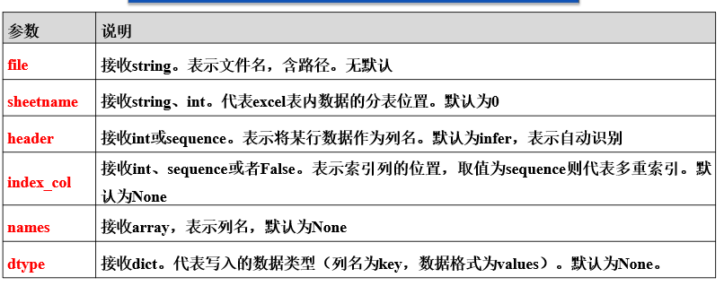

# 文件操作知识点

1. 文件夹操作

> python的标准库os,及子模块`os.path`, `shutil`模块,提供了擦欧总文件和目录的函数

> 当前文件夹得绝对路径

```python
import os.path

os.path.abspath('.')
```

> 列出当前目录下,所有的文件夹及文件,返回一个列表

```python
import os

os.listdir()  # 如果里面传入一个字符串如'c:\\' 会列出c:\\目录下,所有的文件夹及文件,返回一个列表
```

> 创建目录, 创建多级目录, 判断目录\文件是否存在

```python
import os

os.mkdir('d:\\test')  # 创建一个目录: d:\\test
os.makedirs('d:\\python\\test')  # 一次性创建多级目录: d:\\python\\test
os.path.isdir('filePath')  # 判断指定的目录是否存在
os.path.isfile('filePath')  # 判断指定文件是否存在
os.path.exists('filePath')  # 判断指定的目录\文件是否存在
os.path.join('filePath1', 'filePath2')  # 将路径拼接
```

> 使用shutil复制,移动目录及文件

```python
import os
import shutil

os.chdir('d:\\Python\\test')
shutil.copyfile("test.txt", "d:\\test_copy.txt")  # 拷贝当前工作目录下的test.txt至d:\\test_copy.txt 
shutil.move("test.txt", "d:\\test_copy.txt")  # 将当前工作目录下的test.txt文件移至d:\\test_copy.txt
os.remove("d:\\test_copy.txt")  # 删除指定的文件
shutil.copytree("d:\\Python\\test", "d:\\newdir")  # 将d:\\Python\\test下的目录、文件，复制到新路径下
```

2. 文件打开函数 open()

> 2.1 python曹祖各种类型文件的流程都是一致的,顺序如下
> a. **open()** 打开文件, 并返回一个文件对象
> b. 对文件内容进行读,写,删,修改 如: **read(), readline(), readlines()读函数, write()写函数**
> c. 使用文件对象的方法close() 保存文件内容并关闭文件

> 2.2 ** 打开文件的各种模式

|模式 | 意义 | 注意事项 | 
| :---| :---|:---|
|**r**|**只读**,指针在文件**开头**|**文件必须存在**|
|**r+**|**读写**,指针在开口,会覆**盖原有内容**|**文件必须存在**|
|**x**|**只写**模式,新建一个文件,若文件已经存在则会报错| |
|**w**|**只写**模式,清空原有内容,若文件不存在,则创建| 文件存在则**清空**源文件 |
|**w+**|**读写**模式,清空原有内容,若文件**不存在则创建**| 文件存在则**清空**源文件|
|**a**|**写入**模式,若文件**不存在则创建**, 指针在文件末尾(追加)| 不清空原有内容,追加 |
|**a+**|**读写**模式,若文件**不存在则创建**, 指针在文件末尾(追加)| 不清空原有内容,追加 |

> 2.3 **open的使用**

```python
f = open('filePath', encoding='编码')
```

> 2.4 代码演示

```python
f = open('d:/test.txt', 'a+')  # 追加读写模式，在原文件内容最后追加，无原文件新建
print(f.tell())  # 打印光标位置,按字符计数
print(f.readline())  # 按行读 ：一次默认读取 1 行
print(f.read(10))  # 按字符读：一次读取 10 个字符
f.seek(0)  # 把光标回到开头
f.seek(12)  # 把光标移动到12个字符的位置
print(f.encoding)  # 打印文件编码
f.flush()  # 当往文件写内容的时候，会有一个缓存，达到一个时间，一次往文件写入。
# 如果这时候断电可能内容并没有写入成功，flush刷新会立即执行
f.close()
```

3. 上下文管理语句 with

> 关键字 `with` 可以自动管理资源, **结束会自动销毁相关资源, 不需要手动关闭文件, 保证文件被正确关闭**

```python
with open('filename', 'mode', 'encoding') as fp:  # with 控制块结束时，文件会自动关闭
    fp.read()  # 读取文件对象fp中的内容，若open()出现异常，会自动关闭fp
    fp.write('sample')  # 通过文件对象fp，向文件写入内容
    fp.close()  # 关闭文件对象，这行代码是多余的

```

4. 使用xlrd,openpyxl 模块读Excel文件

> python 操作excel主要用到xlrd和xlwt这两个标准库, xltd是读excel,xlwt是写excel


> xlrd 读 excel 步骤如下:
> a 获取book工作簿: wb = xlrd.open_workbook(filename)
> b 获取Sheet工作表: sheet = wb.sheet_by_index(sheet_index)
> c 操作sheet工作表行: row = sheet.role_values(row)
> d 操作sheet工作表列: col = sheet.col(col,beg_row,end_row)


> xlrd 库主要的属性有

```python
import xlrd

filename = ''
# （1）获取Book工作簿(即excel工作簿，包含所有工作表)
wk = xlrd.open_workbook(filename)  # 读取名为filename的工作簿，返回对象
sheetName = wk.sheet_names()  # 返回book中所有工作表的名字

# 获取book下的sheet工作表, 返回值为xlrd.sheet.Sheet()对象
sheet = wk.sheets()[0]  # 通过索引顺序获取
sheet = wk.sheet_by_index(0)  # 通过索引顺序获取
sheet = wk.sheet_by_name('sheetName')  # 通过名称获取
# 操作sheet工作表行(对象为sheet表) 
n = 0
nrows = sheet.nrows  # 获取改sheet中的行数 
sheet.row(n)  # 返回第n行所有的单元格对象组成的列表
sheet.row_values(3, beg_col=0, end_col=2)  # 返回该行开始到结束列组成的列表  
sheet.row_len(3)  # 返回该列的有效单元各长度,即这一行有多少各数据   
```

> 使用openpyxl模块读写xlsx文件

```python
import openpyxl

wb = openpyxl.workbook()  # 创建workbook, 并默认会创建一个空表,名称为sheet
ws1 = wb.active  # 获取默认的sheet 并激活
ws1.title = 'sheet1'  # 设置sheet名称
ws1['A1'] = '姓名'  # 给单元格一个列名
ws1['B1'] = '年龄'
ws1.append(['张三', 18])
ws1.append(['李四', 19])
ws2 = wb.create_sheet('sheet2')  # 创建一个sheet2的sheet
ws3 = wb.copy_worksheet(wb['sheet1'])  # 复制sheet1到sheet3
print(wb.sheetnames)
wb.save('test.xlsx')

```

# Numpy库

使用时需要引入:
`import numpy as np`

> 创建数组并查看数组属性

 ```python
import numpy as np  # 导入Numpy库

arr1 = np.array([1, 2, 3, 4])  # 创建一个一维数组
print(np.shape(arr1))  # 数组的尺寸


 ```

# Matplotlib 库与数据可视化

> 主要内容:
> (1) 折线图plot() 散点图scatter() 直方图hint() 条形图bar() 饼图pie()  
> (2) 坐标轴属性的设置    
> (3) 画布,图例,标题的属性设置  
> (4) 多个子图的设置  


# Pandas 读取数据库的数据

用creat_engine(数据库连接字符串) 简历数据库殷勤连接

```
mysql+pymysql：//用户名:密码@数据库IP地址:数据库端口号/数据库名称？charset = 数据库数据编码
```

用pandas.read_sql(sql,con) 以指定的sql语句查询,以DataFrame的类型返回查询结果

|参数|说明|
|:--|:--|
|sql|接收参数,表示读取数据实的sql查询语句,以DataFrame的类型返回查询结果,无默认|
|con|接收数据库连接,表示数据库连接信息,无默认|


> 访问DataFrame对象中的数据

> DataFrame是最常用的pandas对象,类似于MS Office Excel 表格,完成数据读取后,数据就以DataFrame数据结构存储在内存中
> 但此时并不能直接开始统计分析工作,许哟啊使用DataFrame的书机型语法昂发对数据的分布,大小等几倍呢的数据状况有一个了解,DAtaFarame的属性如下

| 函数 | 返回值 |
|:---| :--- |
| values | 所有行,为二维数组 |
|index| 索引 |
| columns| 所有列名,为index类型|
|dtypes | 类型|
|size|元素个数|
| ndim | 数组的维度数, 返回1,2,3 |
| shape| 数据形状 |


> 访问DataFrame对象中的数据


> 查看访问DataFrame中的数据 loc, iloc访问方式
> 
> loc方法是针对DataFrame 碎银名称的**切片方法** 如果传入的不是索引名称,那么切片操作将无法执行,利用loc方法,能够实现所有单层索引切牌你操作
> 

> loc使用方法如下

```DataFrame.loc[行索引名称或条件,列索索引名称]```  


>iloc的使用方法如下

```DataFrame.iloc[行索引位置,列索引位置]```

```
col_name = trDay.loc[:,'mClose']
print('使用loc提取col_name列的size为：', col_name.size)
col_name2 = trDay.iloc[:,3]                                                        # 返回第3列的所有行
print('使用iloc提取第3列的size为：', col_name2.size)

```


> pandas读写Excel文件
> 
> pandas提供了read_excel函数来读取xls, xlsx两种excel文件




> pandas读写Excel文件

> 将文件存储为Excel文件,可以使用to_excel方法,其语法格式如下:

```DataFrame.to_excel(excel_writer=None,sheetName=None,na_rap='',header=True,index=True,index_label=Nobe,mode='w',encoding=None)```

```python
import pandas as pd
import os
user = pd.read_excel('d:/users.xlsx')         # 读取user.xlsx文件
print('写入excel文件前目录内文件列表为：\n', os.listdir('d:/tmp'))
user.to_excel('d:/tmp/userInfo.xlsx')
print('写入excel文件后目录内文件列表为：\n', os.listdir('d:/tmp'))

```


